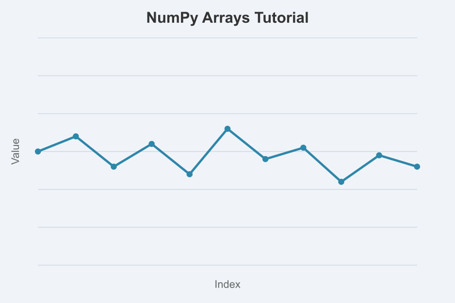

## Student Contributions

This section contains example notebooks contributed by students in the aBCI course. Each notebook demonstrates a concept, technique, or analysis method.

## How to Contribute

Want to add your own example? Follow these steps:

1. **Fork** the repository on GitHub
2. **Create** a Jupyter notebook (`.ipynb`) in this directory
3. **Write** your tutorial with clear explanations
4. **Test** the build locally with `quarto preview`
5. **Submit** a pull request

See the [Contributing Guide](../guide/contributing.qmd) for detailed instructions.

## Example Ideas

Need inspiration for your contribution? Consider:

- **Data Analysis**: Loading and exploring a dataset
- **Visualization**: Creating informative plots with matplotlib or plotly
- **Signal Processing**: Filtering, FFT, time-frequency analysis
- **Statistics**: Hypothesis testing, regression, correlation
- **Machine Learning**: Classification, clustering, dimensionality reduction
- **BCI Concepts**: Signal generation, feature extraction, decoding
- **Python Basics**: NumPy arrays, Pandas DataFrames, function writing
- **Neuroimaging**: Working with EEG/MEG data, preprocessing steps

## Guidelines

Your notebook should:

- ✅ Have a clear title and introduction
- ✅ Explain concepts before showing code
- ✅ Include comments in code cells
- ✅ Show outputs and visualizations
- ✅ Conclude with key takeaways
- ✅ Run without errors

## Available Notebooks

Here are the example notebooks available in this repository. Click on any card to view the full tutorial.

::: {.grid}

::: {.g-col-12 .g-col-md-6}
::: {.card}
{.card-img-top}

::: {.card-body}
### [Introduction to NumPy Arrays](example_numpy_intro.ipynb)

Learn the basics of NumPy arrays, including creation, operations, and statistical analysis. Perfect for beginners!

**Topics**: Arrays, Element-wise operations, Statistics, Visualization

**Author**: Example Author
:::
:::
:::

:::

::: {.callout-tip}
## Want to add your notebook?

Follow the [Contributing Guide](../guide/contributing.qmd) to add your own example notebook to this collection!
:::
